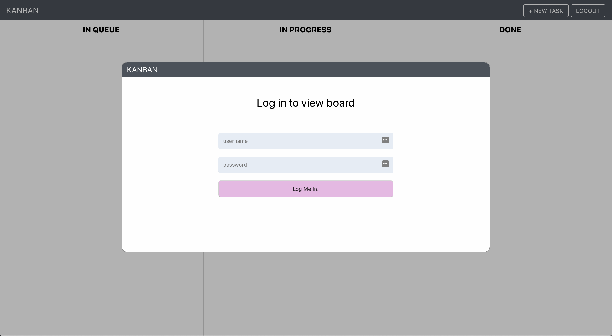
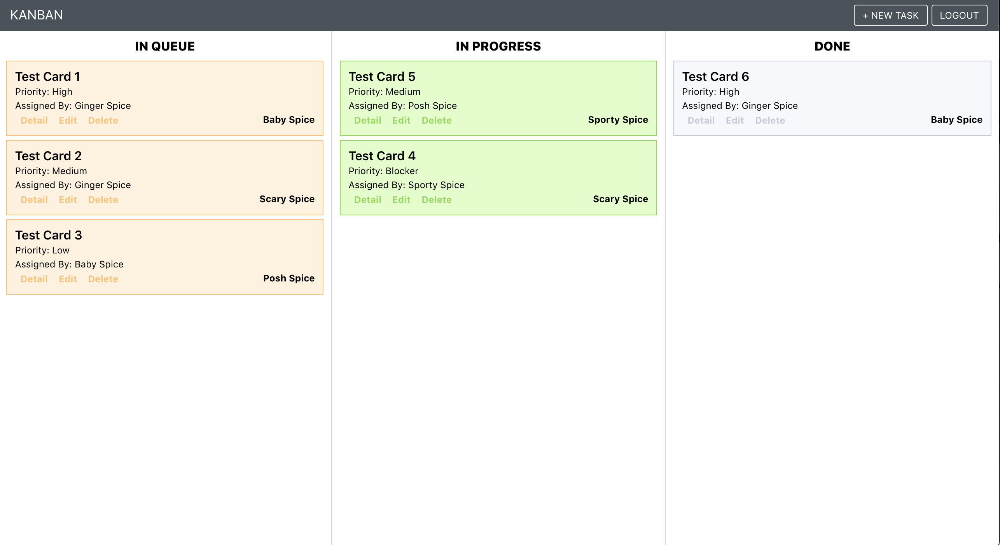

# React Kanban

A kanban board built with React, Redux, and PostgreSQL to help manage projects.

## Technologies Used

* React
* Redux
* Express
* Express Session
* Bcryptjs
* Redis
* Bookshelf.js
* Knex.js
* PostgreSQL
* Docker

## Screenshots

___

